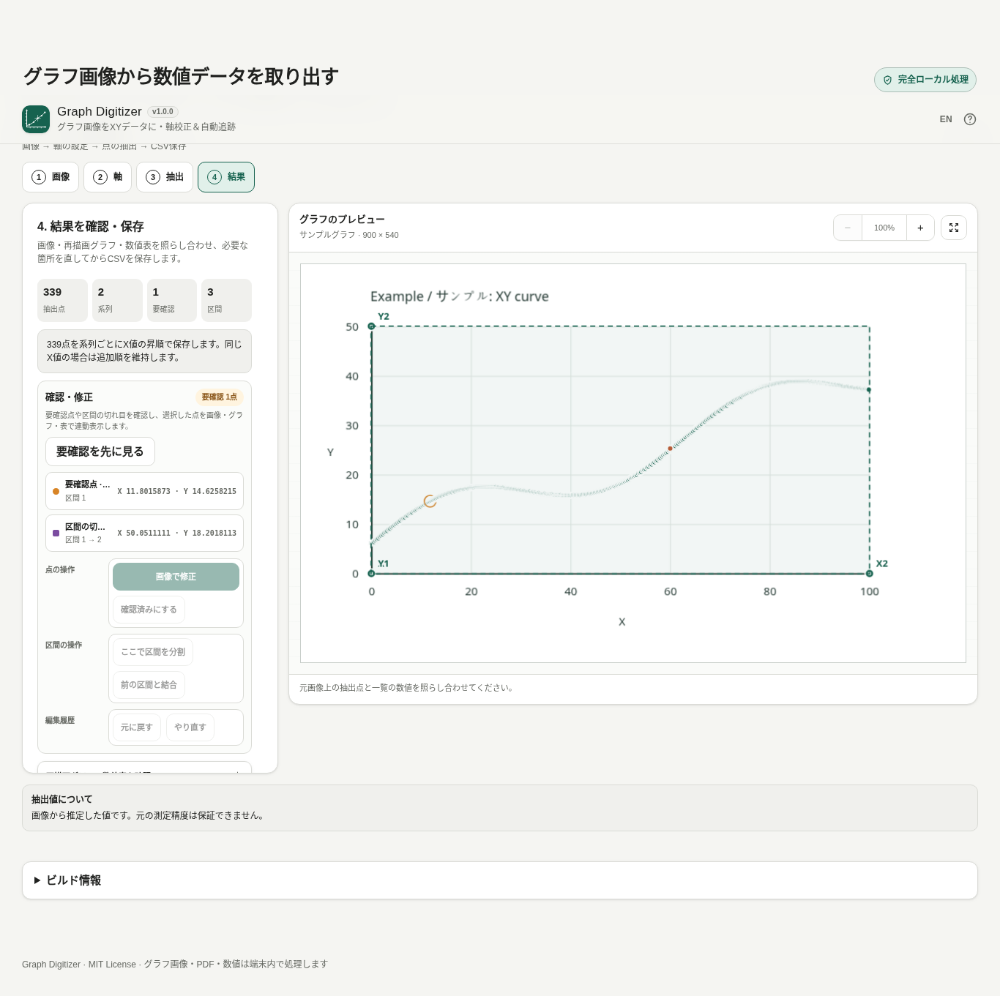

# Graph Digitizer

[](https://github.com/ttomohisa/htmlapps-graph-digitizer/actions/workflows/deploy-pages.yml)
[](LICENSE)
[](https://ttomohisa.github.io/htmlapps-graph-digitizer/)

[English README](README.md)

**グラフ画像やPDFページからXYの数値データを取り出し、CSVとして保存する** Browser Kitty の単一HTMLアプリです。軸を校正し、点を手動で追加するか、色を使って曲線／データマーカーを自動検出し、結果を確認・修正してから保存できます。選択したファイルをアプリからサーバーへアップロードしません。

## 🚀 デモ

### [GitHub PagesでGraph Digitizerを開く](https://ttomohisa.github.io/htmlapps-graph-digitizer/)

GitHub Pagesから最初のHTMLを読み込んだ後、画像／PDFの読み込み、PDFページ描画、軸校正、自動追跡、作業保存・復元、結果確認、CSV生成は端末内で処理されます。選択したファイルや抽出した数値がアプリから外部へ送信されることはありません。

[](https://ttomohisa.github.io/htmlapps-graph-digitizer/)

## 主な機能

- **実際のグラフ軸を4点で校正** — X1・X2・Y1・Y2を指定して対応する数値を入力し、X/Yそれぞれで線形／log10を選択できます。数値が逆向きの軸や、画像上でわずかに回転した直線XY軸にも対応します。
- **手動抽出と細かな位置修正** — グラフをクリックして点を追加し、既存点はドラッグまたは専用の修正画面でルーペ＋1px単位の微調整ができます。複数系列、系列名・色、Undo／Redoにも対応します。
- **色指定の曲線自動追跡** — 曲線色、校正した軸範囲または任意範囲、必要なら開始点を指定し、色許容差・連続性・サンプリング間隔などを調整できます。結果は系列へ反映する前に必ずプレビューします。
- **データマーカーを点として抽出** — 「マーカー」モードでは、接続線を細かく拾うのではなく、四角・丸などの見えているプロットマーカー中心をデータ点として検出します。誤検出はプレビュー上で選択し、`Delete` / `Backspace`で除外してから反映できます。
- **自動結果をそのまま信頼しない確認フロー** — 要確認点と区間の切れ目を表示し、元画像上の重ね合わせ、数値から再描画したグラフ、確認一覧、座標表が同じ選択点に連動します。結果画面から点や区間を修正できます。
- **画像とPDFの両方を入力** — PNG／JPEG／WebPの選択・ドラッグ＆ドロップ・クリップボード貼り付けに対応。PDFはページを選び、必要ならグラフ部分を切り抜いて作業画像にできます。
- **途中作業をファイルで保存・再開** — 現在の作業を `.graphdigitizer.json` に保存できます。作業画像、校正、系列、区間、抽出点、追跡設定、CSV設定を保持し、PDF由来でも元PDFそのものは作業ファイルへ含めません。
- **CSV保存前に中身を確認** — 標準 `series,segment,x,y` と、1系列・1区間の場合の簡易 `x,y` に対応。すべての系列／1系列を選び、実際のCSV本文を確認・コピーしてから保存できます。
- **単一HTML・完全ローカル処理** — PDF.jsと必要なWASMを生成HTMLへ内包。日本語／英語UI、PC／スマホ、通常版単一HTML、自己解凍版HTMLに対応します。

## すぐに使う

### Webで使う

[デモを開く](https://ttomohisa.github.io/htmlapps-graph-digitizer/)だけで利用できます。インストールやアカウント登録は不要です。

### 単一HTMLをビルドして使う

1. このリポジトリをダウンロードまたはクローンします。
2. Windows + PowerShell 7で `build-standalone.bat` または `./build-standalone.ps1` を実行します。
3. 初回だけ `dependencies.json` / `dependencies.lock.json` で固定した依存パッケージを取得します。
4. 生成された `dist/index.html`、または小さい自己解凍ラッパーの `dist/index.self-extract.html` を利用します。

アプリ本体のビルドにはWindows PowerShellと標準の`tar.exe`を使用します。Node.jsは必須ではなく、Node/Pythonは追加の自動テストを実行する場合に使用します。

## 使い方

1. **画像**からグラフ画像またはPDFを追加します。対応ファイルはプレビュー領域へドラッグ＆ドロップでき、画像はクリップボード貼り付けにも対応します。
2. PDFの場合はページを選び、必要なら矩形でグラフ範囲を切り抜いて**このページを使う**を確定します。PDFを開いただけでは現在の作業を置き換えません。
3. **軸**でX/Yそれぞれの線形またはlog10を選び、既知の目盛りを X1 → X2 → Y1 → Y2 と配置して対応する数値を入力します。
4. **抽出**では、手動ならグラフ上をクリックします。自動追跡では、通常の線なら**曲線**、四角・丸などのデータ点が描かれた折れ線なら**マーカー**を選びます。
5. 自動追跡は必ずプレビューされます。不要な検出マーカーはプレビュー上でクリックして選択し、`Delete` / `Backspace`で除外できます。系列へ反映した後の手動点・自動点も、画像上で選択して同じキーで削除できます。問題なければ系列へ反映します。
6. 作業画像は**ドラッグで移動、マウスホイールで拡大縮小**できます。倍率表示をクリックすると100%へ戻り、右隣の全体表示アイコンで画像全体を表示します。
7. 長い作業は `.graphdigitizer.json` として保存できます。作業ファイルは形式を検証してから現在の作業へ復元します。
8. **結果**で要確認点と区間の切れ目を確認・修正し、対象系列とCSV形式を選び、CSVプレビューを確認して保存します。

### 表計算ソフトへ貼り付ける

結果画面で対象系列・形式を選び、**表計算用にコピー**を押してExcelやGoogle Sheetsへ貼り付けます。CSVと同じ行順で、標準4列／簡易2列の全行をタブ区切り（TSV）にします。選択対象の非表示系列も含まれます。自動コピーできない場合（ローカルHTMLのブラウザー制限など）は、CSVプレビューとは別の全行テキスト欄を開いて全選択するので、手動でコピーしてください。

系列名のタブ・改行・制御文字は空白へ置換します。先頭の空白を除いて `= + - @` または引用符で始まる名前には、数式として扱われないようアポストロフィを前置します。通常の名前や途中の引用符、数値列の負数・指数表記は変えません。貼付先によってはアポストロフィが表示され、地域設定によって数値解釈が異なるため、貼付後の列と数値を確認してください。元の系列名とCSVは変更しません。

### 自動追跡のモード

- **曲線** — X方向に沿って色の付いた曲線を追跡します。各Xに対しておおむね1つのYがある通常のXY折れ線を主対象にしています。
- **マーカー** — 線より太い局所的な部分を検出し、描かれているマーカーの中心を返します。観測点を四角・丸などで表示した折れ線グラフに向いています。

長く欠けた部分を自動で補間してつなぐことはありません。欠損は別区間として保持し、保存前に確認できます。

### マウス・キーボード操作

| 操作 | 内容 |
| --- | --- |
| 画像の空いている場所をドラッグ | 作業画像を移動 |
| マウスホイール | ポインター位置を基準に拡大・縮小 |
| 倍率（%）をクリック | 100%へ戻す |
| 矢印キー | 選択中の抽出点を画像上で1px移動 |
| `Shift` + 矢印キー | 選択中の抽出点を10px移動 |
| `Ctrl` / `⌘` + `Z` | 元に戻す |
| `Ctrl` / `⌘` + `Shift` + `Z` または `Ctrl` / `⌘` + `Y` | やり直す |
| `Delete` / `Backspace` | 選択中の自動追跡マーカープレビューを除外、または選択中の抽出点を削除 |

スマートフォンでは、校正点や手動点を置いた直後に確定せず、**仮位置 → ルーペ → 1px単位の微調整 → 確定**の流れで指の下に隠れた位置を修正できます。

## GitHub Pagesで公開する

このリポジトリには、完全内包HTMLをビルドして `dist/` をGitHub Pagesへ自動公開するワークフローが含まれています。

1. リポジトリ名を `htmlapps-graph-digitizer` としてGitHubへプッシュします。
2. **Settings → Pages → Build and deployment → Source** で **GitHub Actions** を選択します。
3. `main`へプッシュするか、Actionsから **Deploy standalone app to GitHub Pages** を手動実行します。
4. 成功後、`https://ttomohisa.github.io/htmlapps-graph-digitizer/` で公開されます。

`main`へのプッシュ時には、固定した依存パッケージから単一HTMLを再生成し、リポジトリ検証、通常版／自己解凍版の整合確認を行ってから、Pagesが有効な場合に公開します。

## 開発・ビルド構成

```text
.
├─ src/index.template.html       # アプリ本体のソース
├─ app.config.json               # アプリ情報・単一HTML設定
├─ dependencies.json             # 固定依存の宣言
├─ dependencies.lock.json        # パッケージ／資産ハッシュの固定
├─ assets/favicon.svg            # faviconと左上ブランドアイコンの正本
├─ build-standalone.bat          # Windows用ビルド入口
├─ build-standalone.ps1          # 単一HTMLビルダー
├─ schemas/project.schema.json   # .graphdigitizer.json format v1
├─ tests/                        # 数値・UI・ブラウザー回帰
├─ dist/index.html               # 生成される通常版単一HTML
├─ dist/index.self-extract.html  # 生成される自己解凍版HTML
└─ .github/workflows/
   ├─ build-standalone.yml       # Pull Request時のビルド検証
   ├─ dependency-updates.yml     # 依存更新の定期確認
   └─ deploy-pages.yml           # mainからPagesへ自動公開
```

`dist/`は直接編集せず、`src/index.template.html`を変更して再ビルドしてください。

### ビルド・検証

Windows + PowerShell 7：

```powershell
./scripts/check-repository.ps1
```

テンプレートのリポジトリ検査、通常版／自己解凍版の生成と検証をまとめて実行します。

Node.jsを使う追加のコア回帰：

```sh
node tests/test-core.mjs
node tests/test-v020-core.mjs
node tests/test-v030-core.mjs
node tests/test-v040-core.mjs
node tests/test-v060-core.mjs
node tests/test-v070-core.mjs
node tests/test-spreadsheet-copy.mjs
node tests/test-standalone.mjs
```

Chromiumの統合回帰は `tests/test-*-browser.py` にあり、Python Playwrightを使用します。

### 依存ライブラリを更新する

依存バージョンは`dependencies.json`で宣言し、`dependencies.lock.json`で固定します。PDF.jsを明示的なバージョンへ更新する例：

```powershell
./scripts/update-dependency.ps1 -Id pdfjs -Version <version>
```

定期ワークフローでも設定したポリシーに従って更新を確認します。更新時は上流変更を確認し、PDF、単一HTML、CSP、Worker／WASM、オフライン動作の回帰を再実行してください。

## プライバシーと通信防止

生成HTMLでは以下を使用します。

- `connect-src 'none'` を含むContent Security Policy
- 実行時CDN、分析、テレメトリ、外部モデル、AI APIなし
- PDF.js本体、Worker、必要なWASMをHTML内へ内包
- 内包資産をBlob URL／仮想資産ローダーから端末内で利用
- 作業ファイル／CSVはユーザーが保存操作をした場合だけ生成

GitHub Pages版では最初のHTML取得には通信が必要ですが、選択した画像／PDF／作業ファイルや抽出座標をアプリから外部へ送信しません。ネットワークを完全に切って利用する場合は、対象ブラウザーで確認した生成済み単一HTMLをローカルで開いてください。

オフライン・リリース確認手順は [VERIFY_OFFLINE.md](VERIFY_OFFLINE.md) を参照してください。

## 制限事項

- 主な対象は、各Xに対しておおむね1つのYがある一般的なXYグラフです。
- 棒グラフ、ヒストグラム、極座標／三角座標／3D、塗りつぶし面積の解析、一般的なグラフOCRには対応していません。
- 写真の遠近歪み、レンズ歪み、湾曲した紙、直線でない軸は自動補正しません。
- マーカーモードは見えているマーカー中心を抽出します。「1月」「2月」のようなカテゴリ名そのものをOCRしてCSVへ入れる機能はありません。必要な場合はX=1〜12のように数値として校正してください。
- 自動追跡は色・形状の見分けやすさに依存します。交差、濃いグリッド、JPEGノイズ、低解像度、系列同士の重なり、近い色では手動修正が必要になる場合があります。
- 長い欠損区間を勝手に補間しません。欠損は別区間になります。
- パスワード保護PDFは非対応です。
- 抽出値は画像位置から読み取った推定値です。元画像に存在しない測定精度を復元するものではありません。
- 画像上限：**20 MiB / 展開後1600万ピクセル**。
- PDF上限：**80 MiB**。作業ページのラスターは**1600万ピクセル以内**に制限します。
- 作業ファイル上限：**96 MiB**。
- 大画像や複雑なPDFでは端末メモリを多く消費します。低メモリ時の案内はありますが、ブラウザー／端末の上限そのものは回避できません。

## 使用ライブラリ

| ライブラリ | バージョン | ライセンス | 用途 |
| --- | ---: | --- | --- |
| PDF.js / `pdfjs-dist` | 6.3.289 | Apache-2.0 | PDFのローカル解析、ページ描画、Worker、補助WASM |

自動追跡、校正、作業ファイル、CSV、アプリUIは追加のランタイムライブラリなしで実装しています。詳細は [THIRD_PARTY_NOTICES.md](THIRD_PARTY_NOTICES.md) を確認してください。

## コントリビューション

バグ報告や機能提案はGitHub Issuesからお願いします。開発への参加方法は [CONTRIBUTING.md](CONTRIBUTING.md) を確認してください。

## ライセンス

Copyright © 2026 ttomohisa

このプロジェクトは [MIT License](LICENSE) で公開されています。
