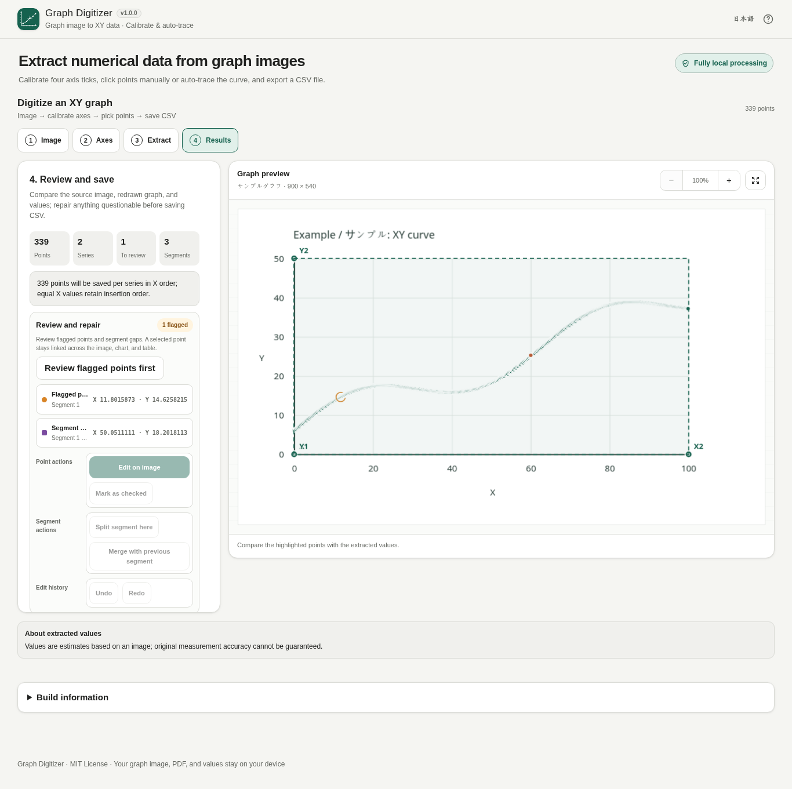

# Graph Digitizer

[](https://github.com/ttomohisa/htmlapps-graph-digitizer/actions/workflows/deploy-pages.yml)
[](LICENSE)
[](https://ttomohisa.github.io/htmlapps-graph-digitizer/)

[日本語版 README](README.ja.md)

A single-HTML Browser Kitty app for extracting reusable XY values from graph images and PDF pages. Calibrate the axes, add points manually or detect a colored curve / visible data markers, review the result, and export CSV without uploading the selected files to a server.

## 🚀 Live demo

### [Open Graph Digitizer on GitHub Pages](https://ttomohisa.github.io/htmlapps-graph-digitizer/)

GitHub Pages delivers the initial HTML. After it loads, image/PDF decoding, PDF rendering, calibration, auto-tracing, project save/restore, review, and CSV generation are processed locally on your device. The files and extracted values you select are not uploaded by the app.

[](https://ttomohisa.github.io/htmlapps-graph-digitizer/)

## Features

- **Calibrate real graph axes** — Place X1, X2, Y1, and Y2, enter the corresponding values, and choose Linear or log10 independently for each axis. Reversed numerical directions and mildly rotated straight XY axes are supported.
- **Digitize by hand with precise repair tools** — Click the graph to add points, drag existing points, or open the selected-point repair view with a loupe and 1-pixel nudging. Multiple named/color-coded series and Undo/Redo are supported.
- **Trace colored curves before committing them** — Pick a curve color, use the calibrated axis area or a custom rectangle, optionally choose a start point, tune tolerance/continuity/sampling, and preview the detected result before applying it to a series.
- **Extract visible data markers as points** — Marker mode detects the centers of visible square/circle-style plot markers instead of sampling the connecting line. Select a false detection in the preview and press `Delete` / `Backspace` to exclude it before applying the result.
- **Review rather than trust blindly** — Review-needed points and segment boundaries stay visible. The source overlay, redrawn numeric graph, review list, and coordinate table share the same selected point; points and segments can be repaired from Results.
- **Open graph images or PDF pages** — Load PNG/JPEG/WebP, paste an image, or open a PDF, select the page, and optionally crop the graph area before using it as the working image.
- **Resume long jobs later** — Save the current state as a versioned `.graphdigitizer.json` project containing the working image, calibration, series, segments, extracted points, tracing settings, and export settings. A project created from a PDF does not embed the original PDF.
- **Inspect CSV before saving** — Export standard `series,segment,x,y`, or simple `x,y` when the selected data is one series and one segment. Choose all series or one series and review/copy the actual CSV text first.
- **Single-file, local runtime** — PDF.js and required WASM assets are embedded in the generated HTML. Japanese/English UI, desktop/mobile layouts, readable standalone HTML, and a self-extracting HTML variant are included.

## Quick start

### Use the web demo

Just [open the demo](https://ttomohisa.github.io/htmlapps-graph-digitizer/). No installation or account is required.

### Build the standalone HTML

1. Download or clone this repository.
2. On Windows with PowerShell 7, run `build-standalone.bat` or `./build-standalone.ps1`.
3. The first build downloads the exact dependency versions pinned in `dependencies.json` / `dependencies.lock.json`.
4. Use the generated `dist/index.html`, or `dist/index.self-extract.html` when you prefer the smaller self-extracting wrapper.

The standalone build uses Windows PowerShell and the built-in `tar.exe`. Node.js is not required to build the app itself; Node/Python are used only by the optional test suites.

## Usage

1. Add a graph image or PDF from the **Image** step. You can also drag a supported file onto the preview or paste an image from the clipboard.
2. For PDF input, choose a page, optionally drag a crop rectangle, and confirm **Use this page**. Merely opening a PDF does not replace the current work.
3. In **Axis**, choose Linear or log10 for each axis, then place X1, X2, Y1, and Y2 on known tick positions and enter their values.
4. In **Extract**, either click points manually or use Auto-trace. For marker-bearing line charts, switch Auto-trace to **Markers** so the visible plot markers become the data points.
5. Auto-trace always shows a preview first. Click an unwanted detected marker in the preview and press `Delete` / `Backspace` to exclude it, or adjust the tracing settings and run again. After applying the preview, selected manual or auto-traced points can be deleted with the same keys. Apply the preview only when it looks right.
6. Drag the working image to pan and use the mouse wheel to zoom. The percentage control returns the image to 100%, while the adjacent Fit icon shows the whole image.
7. Save a `.graphdigitizer.json` project whenever you want to resume later. Project files are validated before they replace current work.
8. In **Results**, inspect review-needed points and segment boundaries, repair them if necessary, choose the target series/CSV format, check the CSV preview, and save the CSV.

### Auto-trace modes

- **Curve** — Samples a colored curve across X. It is intended for ordinary line plots where each X position has approximately one Y value.
- **Markers** — Detects local thickness peaks and returns marker centers. This is useful for line charts where square/circle plot markers represent the actual observations.

Auto-trace does not silently bridge long missing runs. Gaps remain separate segments so they can be reviewed before export.

### Mouse and keyboard controls

| Control | Action |
| --- | --- |
| Drag empty image area | Pan the working image |
| Mouse wheel | Zoom in/out around the pointer |
| Click the percentage | Reset zoom to 100% |
| Arrow keys | Move the selected extracted point by 1 image pixel |
| `Shift` + Arrow keys | Move the selected point by 10 image pixels |
| `Ctrl` / `⌘` + `Z` | Undo |
| `Ctrl` / `⌘` + `Shift` + `Z` or `Ctrl` / `⌘` + `Y` | Redo |
| `Delete` / `Backspace` | Exclude the selected auto-trace marker preview, or delete the selected extracted point |

On touch devices, placing calibration or manual points uses tentative placement → loupe → 1-pixel nudge → Confirm, so the finger does not immediately commit an imprecise point.

## Publish with GitHub Pages

The repository includes a workflow that builds the embedded HTML and deploys `dist/` to GitHub Pages automatically.

1. Push the repository to GitHub as `htmlapps-graph-digitizer`.
2. Open **Settings → Pages → Build and deployment → Source** and select **GitHub Actions**.
3. Push to `main`, or manually run **Deploy standalone app to GitHub Pages** from the Actions tab.
4. After a successful deployment, the demo is available at `https://ttomohisa.github.io/htmlapps-graph-digitizer/`.

Each push to `main` rebuilds the standalone files from pinned dependencies, runs the repository checks, verifies the standalone/self-extract outputs, and then publishes the result when Pages is enabled.

## Development and build layout

```text
.
├─ src/index.template.html       # Application source of truth
├─ app.config.json               # App metadata and standalone settings
├─ dependencies.json             # Pinned dependency declaration
├─ dependencies.lock.json        # Locked package/assets and hashes
├─ assets/favicon.svg            # Canonical favicon + header icon
├─ build-standalone.bat          # Windows build entry point
├─ build-standalone.ps1          # Standalone HTML builder
├─ schemas/project.schema.json   # .graphdigitizer.json format v1
├─ tests/                        # Core + Chromium regressions
├─ dist/index.html               # Generated readable standalone app
├─ dist/index.self-extract.html  # Generated compressed wrapper
└─ .github/workflows/
   ├─ build-standalone.yml       # Pull-request build validation
   ├─ dependency-updates.yml     # Dependency update check
   └─ deploy-pages.yml           # Automatic Pages deployment
```

Do not hand-edit `dist/`; edit `src/index.template.html` and rebuild.

### Build and verify

On Windows with PowerShell 7:

```powershell
./scripts/check-repository.ps1
```

This runs the template repository checks, builds the readable and self-extracting standalone files, and verifies the generated artifacts.

Additional core checks can be run with Node.js:

```sh
node tests/test-core.mjs
node tests/test-v020-core.mjs
node tests/test-v030-core.mjs
node tests/test-v040-core.mjs
node tests/test-v060-core.mjs
node tests/test-v070-core.mjs
node tests/test-standalone.mjs
```

Chromium integration regressions are under `tests/test-*-browser.py` and use Python Playwright.

### Update dependencies

Dependency versions are declared in `dependencies.json` and locked in `dependencies.lock.json`. For example, to prepare an explicit PDF.js update:

```powershell
./scripts/update-dependency.ps1 -Id pdfjs -Version <version>
```

The dependency workflow also checks for updates according to the configured policy. Review upstream changes and rerun the PDF, standalone, CSP, Worker/WASM, and offline regressions before accepting an update.

## Privacy and runtime network protection

The generated HTML includes:

- a Content Security Policy containing `connect-src 'none'`
- no runtime CDN, analytics, telemetry, remote model, or AI API
- embedded PDF.js core, worker, and required WASM assets
- local Blob URLs / virtual asset loading for embedded runtime assets
- project and CSV downloads created only after explicit user actions

The GitHub Pages version requires an initial HTML request, but the image/PDF/project files selected by the user and the extracted coordinates are not transmitted by the app. For use with the network completely disconnected, build and open the standalone HTML locally after verifying it in your target browser.

See [VERIFY_OFFLINE.md](VERIFY_OFFLINE.md) for the offline and release verification procedure.

## Limitations

- Graph Digitizer is designed primarily for ordinary XY plots where each X position corresponds to approximately one Y value.
- Bar charts, histograms, polar/ternary/3D plots, filled-area interpretation, and general-purpose chart OCR are not supported.
- Perspective distortion, camera/lens distortion, curved paper, and non-straight axes are not corrected automatically.
- Marker mode extracts visible marker centers; category labels such as months are not OCRed into text values. Calibrate them numerically (for example, January–December as X = 1–12) when appropriate.
- Auto-trace depends on visible color/shape separation. Crossings, heavy grids, compression artifacts, low resolution, overlapping series, or indistinct colors can require manual repair.
- Missing curve sections are not silently interpolated; long gaps remain separate segments.
- Password-protected PDFs are not supported.
- Extracted numbers are estimates derived from image positions; the app cannot restore measurement precision that is not present in the source graphic.
- Image limit: **20 MiB / 16 million decoded pixels**.
- PDF limit: **80 MiB**; rasterized working pages are capped at **16 million pixels**.
- Project-file limit: **96 MiB**.
- Large images/PDFs can consume substantial device memory; the app provides low-memory guidance but cannot eliminate browser/device limits.

## Dependencies

| Library | Version | License | Purpose |
| --- | ---: | --- | --- |
| PDF.js / `pdfjs-dist` | 6.3.289 | Apache-2.0 | Local PDF parsing, page rendering, worker and support WASM |

Auto-tracing, calibration, project handling, CSV generation, and the application UI are implemented without additional runtime libraries. See [THIRD_PARTY_NOTICES.md](THIRD_PARTY_NOTICES.md) for details.

## Contributing

Bug reports and feature proposals are welcome through GitHub Issues. See [CONTRIBUTING.md](CONTRIBUTING.md) for development guidance.

## License

Copyright © 2026 ttomohisa

Licensed under the [MIT License](LICENSE).
